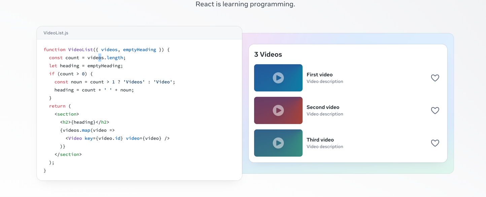

# React + TypeScript + Vite + Antd

此模板提供了一个最小化的设置，以便在 Vite 中使用 React，并支持 HMR（热模块替换）和一些 ESLint 规则。

目前，有两个官方插件可用：

-   [@vitejs/plugin-react](https://github.com/vitejs/vite-plugin-react/blob/main/packages/plugin-react/README.md) 使用 [Babel](https://babeljs.io/) 进行快速刷新
-   [@vitejs/plugin-react-swc](https://github.com/vitejs/vite-plugin-react-swc) 使用 [SWC](https://swc.rs/) 进行快速刷新
## 环境变量

可以设置环境变量，避免用从后台获取
```
// 设置环境变量
VITE_BASE_URL= https://localhost:8080
VITE_USE_TOKEN_AUTHORIZATION=false
// 使用环境变量
import.meta.env.VITE_BASE_URL,
```
## 缓存问题
HTML Jquery开发中，前端页面修改，但是浏览器因为缓存问题，页面没有及时更新。
Vite 通过多种机制来有效解决浏览器缓存问题，确保在开发和生产环境中用户能够及时获取最新版本的资源。以下是 Vite 如何处理浏览器缓存问题的几个关键方面：

#### 1. **文件名哈希**：
- **生产环境中的文件哈希**：在生产模式下构建时，Vite 会为生成的静态资源文件（如 JavaScript 和 CSS 文件）自动添加内容哈希值。例如，`main.js` 可能被构建为 `main.abc123.js`。这个哈希值基于文件内容生成，当文件内容发生变化时，哈希值也会随之变化。这使得浏览器在文件更新时不会使用旧的缓存，而是强制下载新的文件版本。
- **哈希控制缓存**：通过这种哈希机制，浏览器会缓存静态资源文件，但是一旦文件内容发生变化（如代码更新），对应的哈希值也会改变，从而导致文件名变化，这会自动触发浏览器下载新的文件版本。

#### 2. **热模块替换 (HMR)**：
- **开发环境中的 HMR**：在开发模式下，Vite 使用热模块替换 (HMR) 来处理模块的热更新，而不是重新加载整个页面。HMR 通过 WebSocket 连接通知浏览器哪些模块发生了变化，并仅重新加载这些模块。这种机制不仅提高了开发体验，还避免了开发过程中浏览器缓存旧资源的问题。

#### 3. **自动清理缓存**：
- **Service Worker 更新策略**：如果使用了 PWA 插件或 Service Worker，Vite 会确保这些文件能够及时更新。默认情况下，Vite 会将生成的资源文件放入缓存中，当 Service Worker 检测到新的资源时，它会删除旧的缓存并缓存新的资源。这可以避免旧版本资源被长时间缓存的问题。
- **预缓存资源**：在生产环境中，Vite 的 PWA 插件（如 `vite-plugin-pwa`）会自动生成用于缓存的资源清单，并配置缓存策略来确保资源能够及时更新

## EChats
一个基于 JavaScript 的开源可视化图表库


## 扩展 ESLint 配置
ESLint 是一个用于 JavaScript 和 TypeScript 的开源静态代码分析工具。它的主要作用是帮助开发者发现和修复代码中的问题，提高代码质量和一致性。  

如果您正在开发生产应用程序，我们建议更新配置以启用类型感知的 lint 规则：

-   像这样配置顶级的 `parserOptions` 属性：

```js
export default {
    // 其他规则...
    parserOptions: {
        ecmaVersion: 'latest',
        sourceType: 'module',
        project: ['./tsconfig.json', './tsconfig.node.json'],
        tsconfigRootDir: __dirname,
    },
};
```

-   将 `plugin:@typescript-eslint/recommended` 替换为 `plugin:@typescript-eslint/recommended-type-checked` 或 `plugin:@typescript-eslint/strict-type-checked`
-   可选地添加 `plugin:@typescript-eslint/stylistic-type-checked`
-   安装 [eslint-plugin-react](https://github.com/jsx-eslint/eslint-plugin-react) 并将 `plugin:react/recommended` 和 `plugin:react/jsx-runtime` 添加到 `extends` 列表中
## 表单校验
表单校验在传统 HTML JQUERY 中，表单校验写代码非常麻烦，并且加上自定义校验规则和多语言化就更加复杂了
#### antd + react
- 普通校验
```
import { Form, Input, Button } from 'antd';

const Form = () => (
  <Form>
    <Form.Item
      name="email"
      rules={[
        { required: true, message: '请输入您的邮箱!' },
        { type: 'email', message: '请输入有效的邮箱!' }
      ]}
    >
      <Input placeholder="邮箱" />
    </Form.Item>
    <Form.Item
      name="password"
      rules={[
        { required: true, message: '请输入您的密码!' },
        { min: 8, message: '密码不能少于8个字符!' }
      ]}
    >
      <Input.Password placeholder="密码" />
    </Form.Item>
    <Button type="primary" htmlType="submit">登录</Button>
  </Form>
);
```
- 自定义校验规格
```

const Form = () => {
  const validatePasswords = ({ getFieldValue }) => ({
    validator(rule, value) {
      if (!value || getFieldValue('password') === value) {
        return Promise.resolve();
      }
      return Promise.reject('两次输入的密码不一致!');
    }
  });

  return (
    <Form>
      <Form.Item
        name="password"
        rules={[{ required: true, message: '请输入您的密码!' }]}
      >
        <Input.Password placeholder="密码" />
      </Form.Item>
      <Form.Item
        name="confirm"
        rules={[
          { required: true, message: '请确认您的密码!' },
          validatePasswords
        ]}
      >
        <Input.Password placeholder="确认密码" />
      </Form.Item>
      <Button type="primary" htmlType="submit">注册</Button>
    </Form>
  );
};
```
## 插件开发
在 React 开发中，创建可复用的插件或组件可以极大地提高开发效率，并且能够在多个项目中重复使用这些插件或组件。

## 翻译问题
Jquery HTML 使用翻译时， 可能会遇到一些恶性bug，并且修复困难。
使用[i18next](https://react.i18next.com/guides/quick-start)进行翻译，在软件开发任何时间段可以进行国际化，并且简洁，不入侵业务代码
#### 设置 
```
import i18n from "i18next";
import { initReactI18next } from "react-i18next";

// the translations
// (tip move them in a JSON file and import them,
// or even better, manage them separated from your code: https://react.i18next.com/guides/multiple-translation-files)
const resources = {
  en: {
    translation: {
      "Welcome to React": "Welcome to React and react-i18next"
    }
  },
  fr: {
    translation: {
      "Welcome to React": "Bienvenue à React et react-i18next"
    }
  }
};

i18n
  .use(initReactI18next) // passes i18n down to react-i18next
  .init({
    resources,
    lng: "en", // language to use, more information here: https://www.i18next.com/overview/configuration-options#languages-namespaces-resources
    // you can use the i18n.changeLanguage function to change the language manually: https://www.i18next.com/overview/api#changelanguage
    // if you're using a language detector, do not define the lng option

    interpolation: {
      escapeValue: false // react already safes from xss
    }
  });

  export default i18n;
```
#### 使用i8next钩子
```
import React from 'react';

// the hook
import { useTranslation } from 'react-i18next';

function MyComponent () {
  const { t, i18n } = useTranslation();
  return <h1>{t('Welcome to React')}</h1>
}
```
#### 翻译文本
```
import React from 'react';

// the hoc
import { withTranslation } from 'react-i18next';

function MyComponent ({ t }) {
  return <h1>{t('Welcome to React')}</h1>
}

export default withTranslation()(MyComponent);
```
## Antd 主题设置
详情参考[antd官方主页](https://ant.design/theme-editor-cn)
## 路由
## scss
## axios 设置
## API 模块封装
前端的请求接口 分散在各处 没有统一管理 后期维护困难  
解决思路： 把所有的业务接口以函数的形式统一封装到api模块中


## 发布流程

